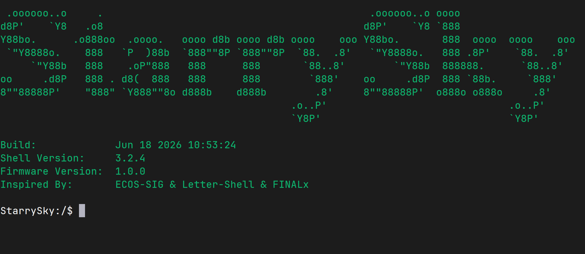
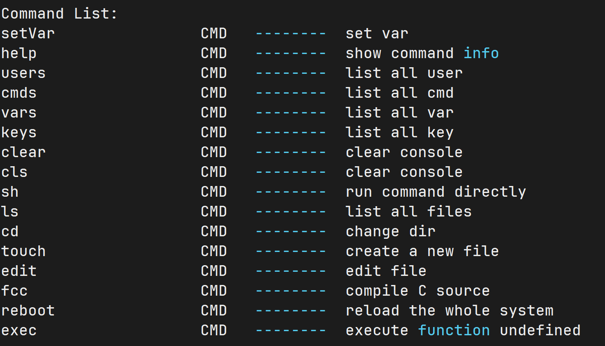
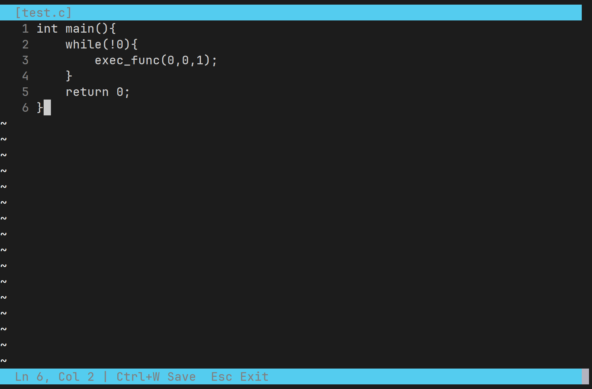
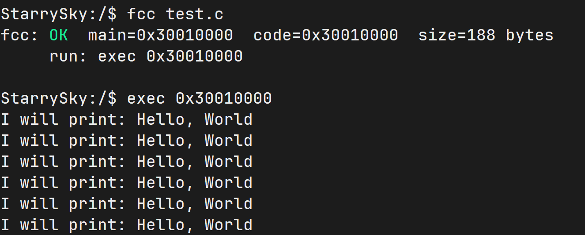

# retroSoC — RISC-V MCU 嵌入式固件

基于 RISC-V RV32IM 架构的嵌入式固件项目，集成 letter-shell 命令行交互环境、FatFs 文件系统、全屏文本编辑器、板载 C 编译器及其他系统组件。

## 可视化界面预览
### 主界面



### 帮助界面



### 文本编辑器



### 简易的C编译器



## 硬件平台

- **MCU**: RISC-V RV32IM, 72 MHz
- **RAM**: SRAM + 8 MB PSRAM
- **存储**: SPI Flash (FatFs 文件系统)
- **适配板卡**: StarrySky C2, L3.1

## 工具链

- **编译器**: `riscv64-unknown-elf-gcc`
- **ABI/架构**: `-mabi=ilp32 -march=rv32im`
- **构建系统**: GNU Make + Kconfig (menuconfig)

## 项目结构

```
.
├── Makefile                  # 顶层构建配置
├── configs/                  # Kconfig 配置与 autoconf 输出
│   ├── config/               # 按模块组织的配置项 (board, cpu, driver, component …)
│   └── generated/            # 生成的 autoconf.h
├── build/                    # 构建产物 (SoC 固件, .map, .lds)
├── Library/                  # Core 运行时: 标准库替代 (stdio, string, libgcc 子集)
├── Startup/                  # 链接脚本、启动代码
├── User/                     # 用户入口 (main.c)
├── System/                   # 片上资源驱动与系统组件
│   ├── letter-shell/         # letter-shell 命令行交互框架
│   ├── text_editor/          # 全屏 ANSI 彩色文本编辑器
│   ├── fcc/                  # 板载 C 编译器 (C → RV32IM)
│   ├── LightCoroutine/       # 轻量化半有栈协程库
│   ├── fatfs/                # FatFs 文件系统 (SPI Flash)
│   ├── sfud/                 # SPI Flash 通用驱动
│   ├── spi_software/         # 软件 SPI 驱动
│   └── TimmoLog/             # 日志库
└── Hardware/                 # 片外资源驱动 (按需自定义)
```

## Shell 命令

固件启动后进入 letter-shell 交互环境，提供以下命令：

| 命令 | 说明 |
|------|------|
| `help` | 显示命令帮助 |
| `ls` | 列出 Flash 文件系统目录 |
| `cd` | 切换工作目录 |
| `touch` | 创建新文件 |
| `edit <file>` | 全屏编辑文件 |
| `fcc <source.c>` | 编译 C 源文件为 RISC-V 机器码 |
| `exec <addr>` | 执行指定地址的机器码 |
| `setVar <name> <value>` | 设置环境变量 |
| `vars` | 列出所有环境变量 |
| `cmds` | 列出所有命令 |
| `keys` | 列出所有按键绑定 |
| `clear` / `cls` | 清屏 |
| `reboot` | 重启系统 |

### Shell 快捷键

| 按键 | 功能 |
|------|------|
| `↑` `↓` `←` `→` | 光标移动 |
| `Tab` | 补全 |
| `Backspace` / `Delete` | 删除 |

## 编辑器 (`edit`)

`edit <filename>` 启动全屏 ANSI 彩色文本编辑器，功能包括：

- 方向键光标导航，行号显示
- 字符插入、删除 (Backspace)、换行
- **Tab 键插入 4 个空格**，缓冲区满时底栏文字提示
- `Ctrl+W` 保存到 Flash，顶栏 `[*]` 修改标记
- `Esc` 退出 (有未保存修改时提示二次确认)
- 最大文件 32 KB，自动创建新文件

详细规格见 [PRD](.scratch/text-editor/PRD.md)。

## 板载编译器 (`fcc`)

`fcc <source.c>` 读取 FatFs 上的 C 源文件，**在 MCU 上实时编译**为 RV32IM 机器码，输出到 PSRAM (基地址 `0x40600000`)。编译后通过 `exec <addr>` 执行。

支持 C 语言子集：
- 类型: `int` (32-bit signed)
- 运算符: `+` `-` `*` `/` `%` `==` `!=` `<` `>` `<=` `>=` `&&` `||` `!` `=`
- 语句: 表达式语句, `if`/`else`, `while`, `return`
- 函数: 定义 (含参数), 调用 (`exec_func` 内建回调)
- 变量: 局部变量 (栈), 全局变量 (BSS)

详见 [PRD](.scratch/fcc/PRD.md)。

## 协程库 (LightCoroutine)

轻量化半有栈协程库，可用于无中断嵌入式多任务场景。支持：

- **无栈协程模式**: 类 protothread 风格，无运行时栈开销
- **半有栈协程模式**: 启用 `USE_CTX` 后支持 `LOCAL()` 栈局部变量，跨 yield 保持状态
- 无时间片 Round-Robin 调度器
- 无需 `malloc`/`free`，适配受限环境 (静态数组分配)

详见 [README](System/LightCoroutine/README.md)。

## 构建

### 前置条件

- StarrySky C2 开发板
- 需要连接外接flash（型号为W25Q64CV，若不适配，可以在sfud_cfg.h中进行修改，所有支持型号可以参考sfud仓库）
- RISC-V 交叉编译工具链: `riscv64-unknown-elf-gcc`
- GNU Make

### 编译

```shell
make menuconfig   # 需要勾选TimmoLog、QSPI、SFUD、FATFS、LETTER_SHELL以启用宏定义（LightCoroutine等其他组件可选）
make              # 编译生成固件到 build/
```

### 注意事项
- 脱离 SDK 环境后 (分离式工程) 直接 `make` 即可增量编译，但 `menuconfig` 需要 SDK 环境。
- 由于该版本的menuconfig尚未更新到主仓库，因此text-editer和fcc默认包含在LetterShell中，无需勾选。

## License

各组件按各自 License 分发，详见对应目录。